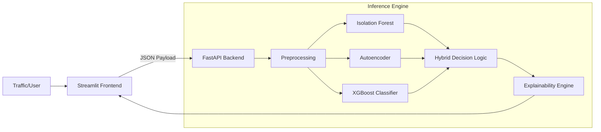

# Hybrid ML-WAF (Web Application Firewall)

## Problem Statement
Traditional Web Application Firewalls (WAFs) often rely on static signature matching, making them ineffective against zero-day attacks, sophisticated polymorphic threats, and complex behavioral anomalies (e.g., slow-rate DDoS). There is a critical need for an intelligent, adaptive security layer that can detect both known and unknown threats in real-time while providing actionable explanations for security analysts.

## Solution Overview
This project implements a **Hybrid Machine Learning WAF** that combines unsupervised anomaly detection with supervised signature classification. It is architected as a decoupled Client-Server application:
*   **Backend (FastAPI)**: A high-performance inference engine that hosts the ML models and exposes specific endpoints for traffic inspection.
*   **Frontend (Streamlit)**: A modernized "Dark Mode" dashboard for SecOps teams to visualize traffic risk, view SHAP-based explanations, and manage rule recommendations.

## Architecture Diagram


## ML Models Used
The "Hybrid" engine uses a stacked approach to maximize coverage:
1.  **Isolation Forest**: Unsupervised model to detect statistical outliers (Global Anomalies).
2.  **Autoencoder (Deep Learning)**: Neural network trained on benign traffic to detect deviations (Local/Pattern Anomalies).
3.  **XGBoost Classifier**: Supervised Gradient Boosting model trained on labeled attack data for high-precision signature detection of known threats (SQLi, XSS, etc.).

## Dataset Used
The models were trained using a subset of the **CIC-IDS-2017 / CIC-IDS-2018** datasets.
*   **Benign Traffic**: Normal web browsing and background traffic.
*   **Attack Classes**: SQL Injection, XSS, Brute Force, DoS/DDoS, Botnet, and Port Scanning.
*   **Preprocessing**: Balanced sampling and standard scaling applied.

## How to Run the Project
The application requires running the Backend and Frontend in separate terminals.

### Prerequisites
```bash
pip install -r requirements.txt
```

### Step 1: Start Backend (Terminal 1)
```bash
uvicorn api.app:app --port 8000
```
*Wait for "Application startup complete".*

### Step 2: Start Frontend (Terminal 2)
```bash
streamlit run UI/waf_gui.py
```

## Results / Metrics
*   **Detection Accuracy**: ~99% (Weighted F1-Score on Test Set).
*   **Inference Latency**: < 10ms per sample (Batched).
*   **Explainability**: Full Feature Attribution via SHAP.

## Innovation / Future Scope
*   **Zero-Day Detection**: The Autoencoder component can flag never-before-seen attacks based on reconstruction error.
*   **Explainable AI (XAI)**: Unlike black-box solutions, this WAF tells *why* a request was blocked (e.g., "High Packet Rate" or "Abnormal Bytes/s").
*   **Future Scope**:
    *   Integration with live NGINX/Apache logs.
    *   Active learning loop (retraining on analyst feedback).
    *   Deployment via Docker/Kubernetes.
