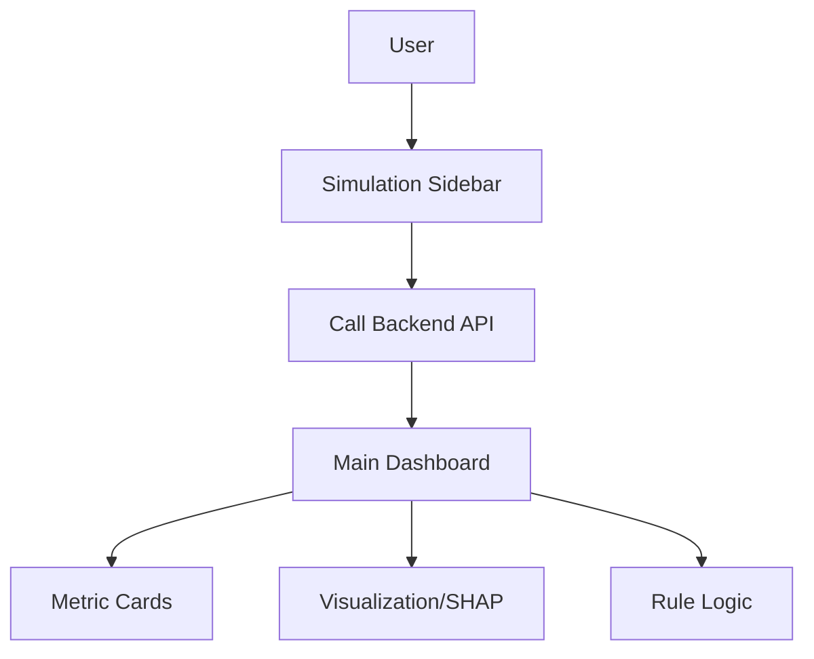

# WAF Admin Dashboard

## Problem Statement
Security analysts are often overwhelmed by raw logs and black-box alerts. They lack a visual interface to simulate traffic, understand why a specific request was blocked, and provide feedback to the system.

## Solution Overview
This directory contains the **Streamlit Frontend**, a lightweight, interactive dashboard designed for SecOps professionals. It connects to the backend API to provide:
*   Real-time Traffic Simulation.
*   Visual Risk Assessment (Speedometers/Gauges).
*   Detailed Attack attribution & Explainability.

## Architecture Diagram


## ML Models Used
**None directly.** This component is a pure client. It offloads all ML computation to the FastAPI backend. It purely visualizes the *outputs* of the models.

## Dataset Used
*   `../data/test_samples_final.csv`: Used to populate the "Traffic Simulator" dropdown for testing purposes.

## How to Run the Project
Navigate to the project root and run:
```bash
streamlit run UI/waf_gui.py
```
*Note: Ensure the backend API is running on port 8000 first.*

## Results / Metrics
*   **User Experience**: "Dark Mode" aesthetic for reduced eye strain in SOC environments.
*   **Interactivity**: Instant feedback loop (Simulation -> Result).

## Innovation / Future Scope
*   **No-Code Interface**: Allows non-technical users to inspect ML model behavior.
*   **Rule Engine**: Translates ML probability into human-readable action (BLOCK/ALLOW).
*   **Future Scope**:
    *   WebSocket integration for live log streaming.
    *   One-click "Report False Positive" that updates the model.
