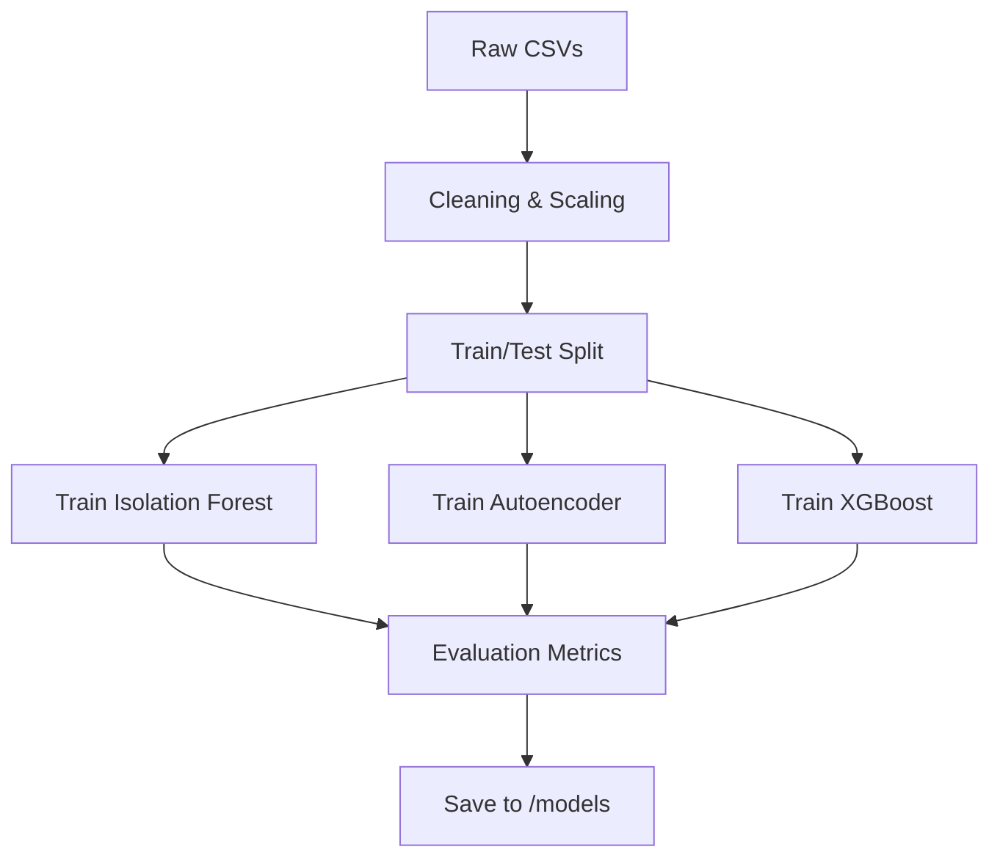

# Model Training Pipeline

## Problem Statement
Developing a robust WAF requires training models on massive, high-dimensional datasets. The challenge lies in feature selection, handling extreme class imbalance (far more benign traffic than attacks), and creating a model that generalizes well to new attacks.

## Solution Overview
This directory hosts the experimental **Jupyter Notebook (`IsolationForest.ipynb`)** which serves as the end-to-end training pipeline. It handles data ingestion, cleaning, feature engineering, and model persistence.

## Architecture Diagram

## ML Models Used
1.  **Isolation Forest**: detecting outliers.
2.  **Autoencoder**: Deep Neural Net for reconstruction error (TensorFlow/Keras).
3.  **XGBoost**: Gradient Boosting for multi-class classification.

## Dataset Used
*   **Source**: CIC-IDS-2017 / 2018.
*   **Features**: 70+ flow features (Flow Duration, Bwd Packets/s, IAT, etc.).
*   **Logic**: Downsampling benign class to 1:1 ratio with attacks for balanced training.

## How to Run the Project
1.  Navigate to this folder.
2.  Start Jupyter: `jupyter notebook`
3.  Run `IsolationForest.ipynb` top-to-bottom.
4.  New models will be generated in `../models/`.

## Results / Metrics
*   **Confusion Matrix**: Visualized in the notebook (Seaborn Heatmap).
*   **Loss Curves**: Training vs Validation loss for Autoencoder convergence.
*   **Classification Report**: Precision, Recall, F1-Score for each attack class.

## Innovation / Future Scope
*   **Hybrid Training**: Training unsupervised and supervised models on the same data split to ensure compatibility.
*   **Class Weights**: "Balanced" weighting handling rare attack types.
*   **Future Scope**:
    *   Hyperparameter tuning via Optuna.
    *   drift detection integration.
